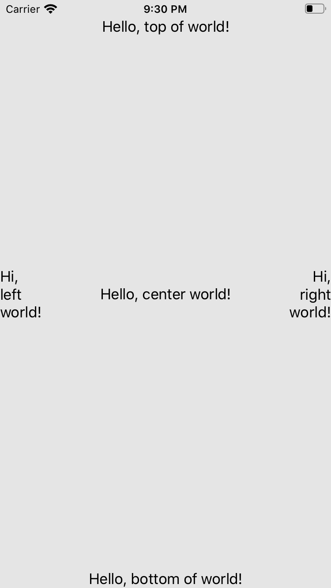

# Introduction

This project shows examples of UILable views in Swift.

---

# Description

This example demonstrates

* how to define UILabel views with code (not storyboard)
* how to set the properties of UILabel object
* how to locate views using SnapKit library

---

# Screenshot

</img>

---

# References

* [Create a New iOS Project without Storyboard](https://medium.com/macoclock/create-a-new-ios-project-without-storyboard-b0caaa3baf70)
* [UILabel class](https://developer.apple.com/documentation/uikit/uilabel)
* [SnapKit](https://github.com/SnapKit/SnapKit)
* [Then](https://github.com/devxoul/Then)
