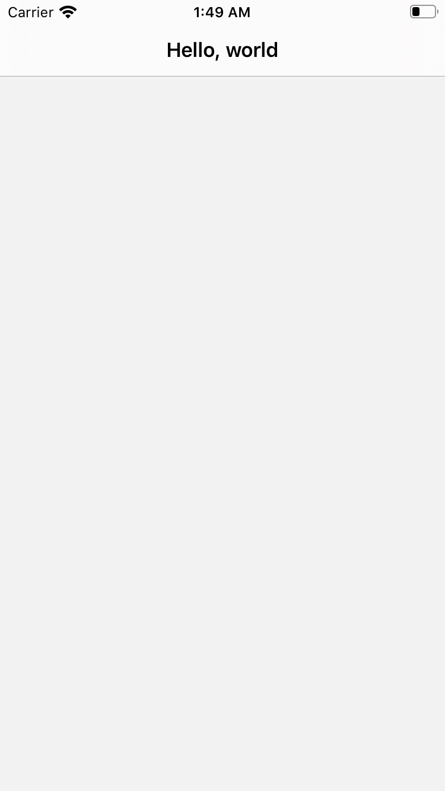

# Introduction

This project is the 1st example of navigation bar based on iOS in Swift. Its definition is code-based, not using storyboard.

---

# Description

This example demonstrates

* how to define UINavigationController object in SceneDelegate class
* how to set the title of navigation bar

---

# Screenshot

It is simple. It just shows the navigation bar with title and empty content.

</img>

---

# How to define UINavigationController

Step 1. Define UINavigationController object into scene(scene:willConnectTo:options:) method of SceneDelegate class.

```
func scene(_ scene: UIScene, willConnectTo session: UISceneSession, options connectionOptions: UIScene.ConnectionOptions) {
    let nc = UINavigationController()
}
```

Step 2. Define your view controller object such as ExViewController.

```
func scene(_ scene: UIScene, willConnectTo session: UISceneSession, options connectionOptions: UIScene.ConnectionOptions) {
    let nc = UINavigationController()
    let firstVC = ExViewController()
}
```

Step 3. Include your view controller into the view controllers of UINavigationController object.

```
func scene(_ scene: UIScene, willConnectTo session: UISceneSession, options connectionOptions: UIScene.ConnectionOptions) {
    let nc = UINavigationController()
    let firstVC = ExViewController()
    nc.viewControllers = [firstVC]
}
```

Step 4. Define window scene and window objects, and set the root view controller of the window to the UINavigationController object.

```
func scene(_ scene: UIScene, willConnectTo session: UISceneSession, options connectionOptions: UIScene.ConnectionOptions) {
    guard let windowScene = (scene as? UIWindowScene) else { return }

    let nc = UINavigationController()
    let firstVC = ExViewController()
    nc.viewControllers = [firstVC]

    window = UIWindow(frame: UIScreen.main.bounds)
    window?.rootViewController = nc
    window?.makeKeyAndVisible()
    window?.windowScene = windowScene
}
```

---

# How to set the title of navigation bar

The subclass of UIViewContoller can access navigationItem property. You can set the title of the navigation bar using title property of the bar.

```
navigationItem.title = “Hello, world”
```

---

# References

* [StackOverflow - Creating a navigationController programmatically (Swift)
](https://stackoverflow.com/questions/28793331/creating-a-navigationcontroller-programmatically-swift)
* [UINavigationController class](https://developer.apple.com/documentation/uikit/uinavigationcontroller)
