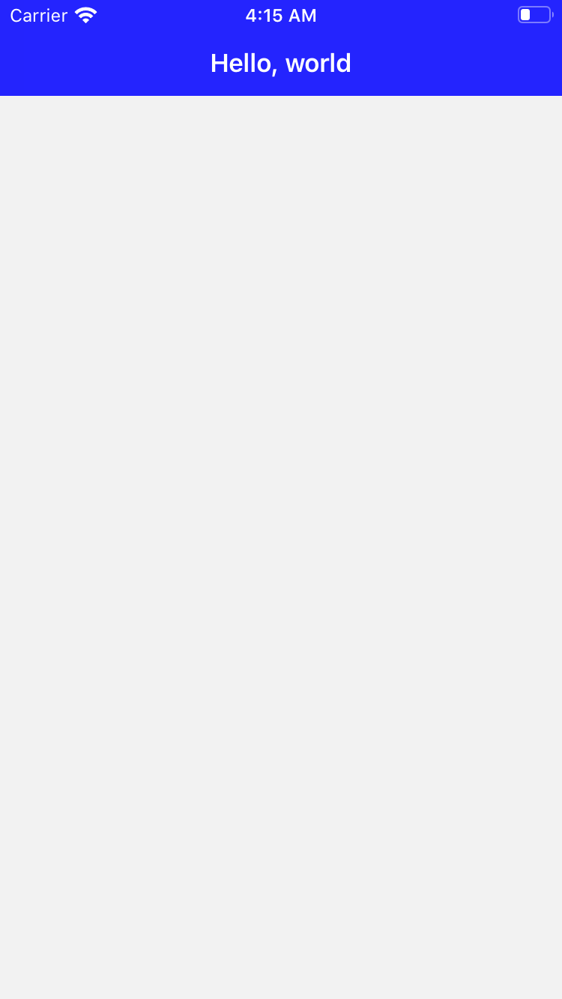

# Introduction

This project is the 2nd example of navigation bar based on iOS in Swift. Its definition is code-based, not using storyboard. This example demonstrates

* how to change the background color of the navigation bar and status bar
* how to change the text color of the title on the navigation bar
* how to change the foreground color of the status bar
* how to set the navigation bar when an application is started.

---

# Screenshot

It is simple. It just shows the navigation bar with title and empty content.

</img>

---

# How to change the text color of the title on the navigation bar

* Set the foreground color of titleTextAttributes of the navigation bar.
* Example: Set the color of the title to white

```
navigationController?.navigationBar.titleTextAttributes = [
    .foregroundColor : UIColor.white
]
```

---

# How to change the background color of the navigation bar and status bar

* Set barTintColor property of the navigation bar to the color you want.
* Example: Set barTintColor to blue

```
navigationController?.navigationBar.barTintColor = .blue
```

---

# How to change the foreground color of the status bar

* Set barStyle property of the navigation bar to UIBarStyle.black
* When UIBarStyle.black is set, the foreground colors of the navigation bar and status bar becomes white.

```
navigationController?.navigationBar.barStyle = UIBarStyle.black
```

---

# How to set the navigation bar when an application is started

Step 1. Implement a method to customize your navigation bar.

* Example: In case of me, I extended UINavigationBar class and defined the method.

```
extension UINavigationBar {

    func initCustom() {
        barStyle = UIBarStyle.black
        barTintColor = .blue
        titleTextAttributes = [
            .foregroundColor : UIColor.white
        ]
    }

}
```

Step 2. Call the method implemented at step 1 after UINavigationController object is created.

* Example

```
// This method is in SceneDelegate class
func scene(_ scene: UIScene, willConnectTo session: UISceneSession, options connectionOptions: UIScene.ConnectionOptions) {
    guard let windowScene = (scene as? UIWindowScene) else { return }

    let nc = UINavigationController()
    let firstVC = ExViewController()
    nc.viewControllers = [firstVC]
    nc.navigationBar.initCustom()

    window = UIWindow(frame: UIScreen.main.bounds)
    window?.rootViewController = nc
    window?.makeKeyAndVisible()
    window?.windowScene = windowScene
}
```

---

# Unit Test

Tested initCustom() method with XCTest. It checks the initialized values of barStyle, barTintColor and titleTextAttributes properties of the navigation bar.

```
class NavigationBarEx02Tests: XCTestCase {

    // ...

    func testInitCustom() throws {
        let navigationBar = UINavigationBar()
        navigationBar.initCustom()
        XCTAssertEqual(UIBarStyle.black, navigationBar.barStyle)
        XCTAssertEqual(UIColor.blue, navigationBar.barTintColor)
        XCTAssertEqual(UIColor.white, navigationBar.titleTextAttributes?[.foregroundColor] as? UIColor)
    }

}
```

---

# References

* [Customizing Your App’s Navigation Bar](https://developer.apple.com/documentation/uikit/uinavigationcontroller/customizing_your_app_s_navigation_bar)
* [UINavigationController class](https://developer.apple.com/documentation/uikit/uinavigationcontroller)
* [UINavigationBar class](https://developer.apple.com/documentation/uikit/uinavigationbar)
* [StackOverflow - Creating a navigationController programmatically (Swift)
](https://stackoverflow.com/questions/28793331/creating-a-navigationcontroller-programmatically-swift)
