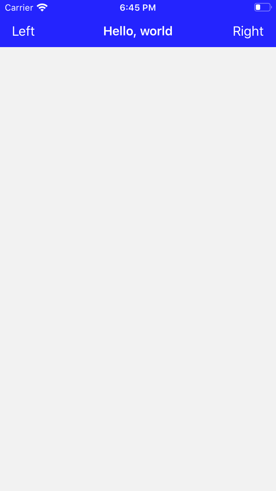
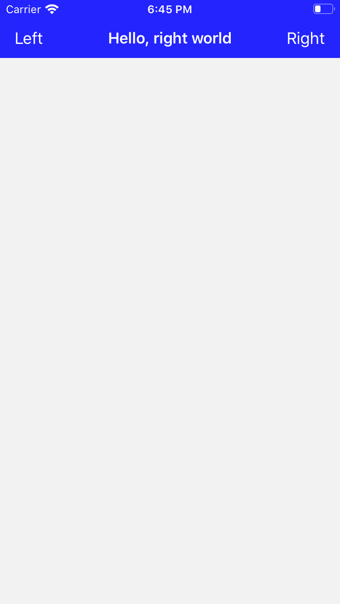

# Introduction

This project is the 3rd example of navigation bar based on iOS in Swift. Its definition is code-based, not using storyboard. This example demonstrates

* how to add a button into the left or right side of the navigation bar
* how to handle clicking a button
* how to test clicking a button using XCTest

---

# Screenshot

As soon as this app starts, the navigation bar title is "Hello, world".

</img>

When you click Left button, the title changes to "Hello, left world".

</img>

When you click Right button, the title changes to "Hello, right world".

</img>

---

# How to add a button into the left or right side of the navigation bar

* Step 1: Define buttons.

```
class ExViewController: UIViewController {

    private let leftBarButton: UIButton = {
        let button = UIButton()
        button.accessibilityIdentifier = "leftBarButton"
        button.setTitle("Left", for: .normal)
        return button
    }()

    private let rightBarButton: UIButton = {
        let button = UIButton()
        button.accessibilityIdentifier = "rightBarButton"
        button.setTitle("Right", for: .normal)
        return button
    }()

    // ...
}
```

* Step 2: Define UIBarButtonItem objects. Set their view to the buttons defined above.

```
let leftBarButtonItem = UIBarButtonItem(customView: leftBarButton)
let rightBarButtonItem = UIBarButtonItem(customView: rightBarButton)
```

* Step 3: Set left or right bar button item of the navigation bar to what you defined at step 2.

```
navigationItem.leftBarButtonItem = UIBarButtonItem(customView: leftBarButton)
navigationItem.rightBarButtonItem = UIBarButtonItem(customView: rightBarButton)
```

---

# How to handle clicking a button

* Step 4: Define the methods to handle clicking buttons.

```
@objc
func onClickLeftBarButton() {
    navigationItem.title = "Hello, left world"
}

@objc
func onClickRightBarButton() {
    navigationItem.title = "Hello, right world"
}
```

* Step 5: Register butotn click events for the buttons.

```
leftBarButton.addTarget(self, action: #selector(onClickLeftBarButton), for: .touchUpInside)
rightBarButton.addTarget(self, action: #selector(onClickRightBarButton), for: .touchUpInside)
```

---

# UI Test

Tested clicking buttons.

* Clicks the left bar button, and checks if the title changes to "Hello, left world"
* Clicks the right bar button, and checks if the title changes to "Hello, right world"

```
import XCTest

class NavigationBarEx03UITests: XCTestCase {

    // ...

    func testLeftBarButtonClick() throws {
        let app = XCUIApplication()
        app.launch()

        app.buttons["leftBarButton"].tap()
        XCTAssertTrue(app.navigationBars.staticTexts["Hello, left world"].exists)
    }

    func testRightBarButtonClick() throws {
        let app = XCUIApplication()
        app.launch()

        app.buttons["rightBarButton"].tap()
        XCTAssertTrue(app.navigationBars.staticTexts["Hello, right world"].exists)
    }

}
```

---

# References

* [Customizing Your App’s Navigation Bar](https://developer.apple.com/documentation/uikit/uinavigationcontroller/customizing_your_app_s_navigation_bar)
* [How to programmatically setup UIButton in Swift 4 - Apple Developer Forums](https://developer.apple.com/forums/thread/93409)
* [UIButton class](https://developer.apple.com/documentation/uikit/uibutton)
* [UINavigationBar class](https://developer.apple.com/documentation/uikit/uinavigationbar)
* [UINavigationController class](https://developer.apple.com/documentation/uikit/uinavigationcontroller)
