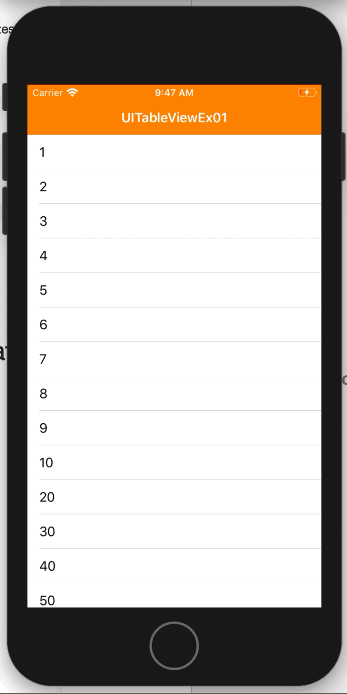

# Introduction

This project is the 1st example of table view based on iOS in Swift. Its definition is code-based, not using storyboard. This example demonstrates

* how to implement a table view that shows a number list

---

# Screenshot

This sample app show a number list, and you can scroll up and down.

</img>

---

# How to implement a table view that shows a number list

* Step 1: Define a number list.

```
let numbers = [1, 2, 3, 4, 5, 6, 7, 8, 9, 10, 20, 30, 40, 50, 60, 70, 80, 90, 100]
```

* Step 2: Define a table view.

```
let exTable = UITableView()
```

* Step 3: Set the data source and delegate of the table view defined at step 2. You can set them to your view controller

```
class ExViewController: UIViewController {

    private let exTable = UITableView()

    override func viewDidLoad() {
        // ...
        initViews()
    }

    private func initViews() {
        // ...
        exTable.dataSource = self
        exTable.delegate = self
    }
}
```

* Step 4: Implement the data source and delegate of the table view. You can set how many rows the table has, and you can implement how the table views its rows. In this example, each cell just shows its number. Cell means a view that shows a row of a table view.

```
extension ExViewController: UITableViewDataSource, UITableViewDelegate {

    func tableView(_ tableView: UITableView, numberOfRowsInSection section: Int) -> Int {
        return numbers.count
    }
    
    func tableView(_ tableView: UITableView, cellForRowAt indexPath: IndexPath) -> UITableViewCell {
        let cell = UITableViewCell(style: .default, reuseIdentifier: String(describing: UITableViewCell.self))
        cell.textLabel?.text = "\(numbers[indexPath.row])"
        return cell
    }

    func tableView(_ tableView: UITableView, heightForRowAt indexPath: IndexPath) -> CGFloat {
        return UITableView.automaticDimension
    }

}
```

---

# UI Test

Tested if there exists the table view with accessibility identifier.

```
let table = app.tables["exTable"]
XCTAssertTrue(table.exists)
```

Tested if the table has 19 cells. The number list has 19 elements.

```
let cells = table.cells
XCTAssertEqual(19, cells.count)
```

Tested the text of each table cell.
* Does the text of the 1st cell is "1"?
* Does the text of the 2nd cell is "2"?
* Does the text of the 3rd cell is "3"?
* ...

```
let cell0 = cells.element(boundBy: 0)
XCTAssertTrue(cell0.staticTexts["1"].exists)

let cell1 = cells.element(boundBy: 1)
XCTAssertTrue(cell1.staticTexts["2"].exists)

let cell2 = cells.element(boundBy: 2)
XCTAssertTrue(cell2.staticTexts["3"].exists)

// ...
```

---

# References

* [Tutorial: Adding a UITableView programmatically (Martin Lasek)](https://medium.com/@martinlasek/tutorial-adding-a-uitableview-programmatically-433cb17ae07d)
* [UITableView class](https://developer.apple.com/documentation/uikit/uitableview)
* [UITableViewDataSource](https://developer.apple.com/documentation/uikit/uitableviewdatasource)
* [UITableViewDelegate](https://developer.apple.com/documentation/uikit/uitableviewdelegate)
