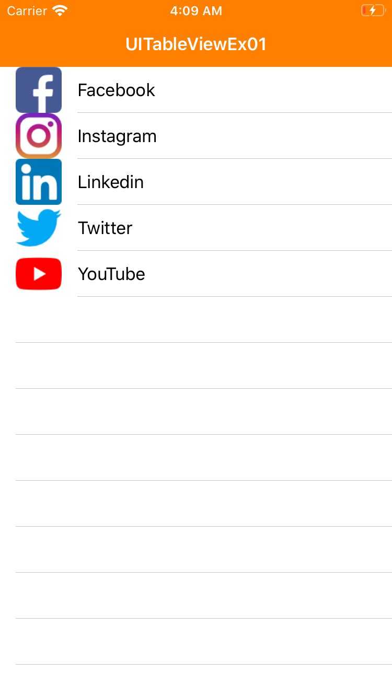

# Introduction

This project is the 2nd example of table view based on iOS in Swift. Its definition is code-based, not using storyboard. This example demonstrates

* how to implement table cells that shows its image and text with UITabelViewCell class 

---

# Screenshot

This sample app show a table view, and each cell has a image and a text.

</img>

Icons made by [Freepik](https://www.flaticon.com/authors/freepik) from [www.flaticon.com](https://www.flaticon.com/)

---

# How to implement table cells that shows its image and text with UITabelViewCell class

* Step 1: Copy image files into Assets.xcassets by dragging from finder and dropping into Assets.xcassets on Project Navigator.

* Step 2: Define a model class that represents the data of a cell to be showed.

```
class MenuItem {

    let name: String
    let image: String
    
    init(name: String, image: String) {
        self.name = name
        self.image = image
    }

}
```

* Step 3: Define a list with elements of the model class defined in step 2.

```
let menuItems = [
    MenuItem(name: "Facebook", image: "facebook.png"),
    MenuItem(name: "Instagram", image: "instagram.png"),
    MenuItem(name: "Linkedin", image: "linkedin.png"),
    MenuItem(name: "Twitter", image: "twitter.png"),
    MenuItem(name: "YouTube", image: "youtube.png")
]
```

* Step 4: Define a table view, and set the data source and delegate of the table view.

```
// In this example, self means the view controller of this table view
lazy var exTable = UITableView().then { (table) in
    table.accessibilityIdentifier = "exTable"
    table.dataSource = self
    table.delegate = self
}
```

* Step 4: Implement the data source and delegate of the table view. You can set how many rows the table has, and you can implement how the table views its rows. In this example, each cell just shows its number. Cell means a view that shows a row of a table view.

```
extension ExViewController: UITableViewDataSource, UITableViewDelegate {

    func tableView(_ tableView: UITableView, numberOfRowsInSection section: Int) -> Int {
        return menuItems.count

    }
    
    func tableView(_ tableView: UITableView, cellForRowAt indexPath: IndexPath) -> UITableViewCell {
        let row = indexPath.row
        let cell = UITableViewCell(style: .default, reuseIdentifier: String(describing: UITableViewCell.self))
        cell.imageView?.image = UIImage(named: menuItems[row].image)
        cell.imageView?.accessibilityIdentifier = "imageView\(row)"
        cell.textLabel?.text = "\(menuItems[row].name)"
        cell.textLabel?.accessibilityIdentifier = "textView\(row)"

        return cell
    }

    func tableView(_ tableView: UITableView, heightForRowAt indexPath: IndexPath) -> CGFloat {
        return UITableView.automaticDimension
    }
   
}
```

---

# Unit Test

* It is impossible to check the contents of image views with UI test, but possible with unit test.
* To test ExViewController class, define its child class ExViewController

```
class TestExViewController: ExViewController {
    
    override func viewDidLoad() {
        super.viewDidLoad()
    }

}
```

* Override the methods declared in UITableViewDataSource and UITableViewDelegate protocols and implemented in ExViewController class. 
  * tableView(tableView:numberOfRowsInSection:)
    * Tests if the table view has only one section and five cells.
  * tableView(tableView:cellForRowAt)
    * Tests if cells have right image and text. 

```
extension TestExViewController {

    /// Tests counts of section and menu items
    override func tableView(_ tableView: UITableView, numberOfRowsInSection section: Int) -> Int {
        XCTAssertEqual(0, section)
        XCTAssertEqual(5, menuItems.count)
        return super.tableView(tableView, numberOfRowsInSection: section)
    }

    ///  Tests text and image contents of each cell
    override func tableView(_ tableView: UITableView, cellForRowAt indexPath: IndexPath) -> UITableViewCell {
        let row = indexPath.row
        let cell = super.tableView(tableView, cellForRowAt: indexPath)
        
        XCTAssertEqual(UIImage(named: menuItems[indexPath.row].image), cell.imageView?.image)
        XCTAssertEqual(menuItems[row].name, cell.textLabel?.text)
        return cell
    }

}
```

* Define and set up TestExViewController object

```
class ExViewControllerTests: XCTestCase {

    let testVC = TestExViewController()

    override func setUpWithError() throws {
        testVC.loadViewIfNeeded()    // viewDidLoad() is called.
    }

    // ...
}
```

* Load contents of the table view by calling reloadData() method. The view controller not only read them but also run its test code.

```
class ExViewControllerTests: XCTestCase {

    // ...

    /// Tests if data are normally loaded into the cells of the table
    func testCellData() throws {
        testVC.exTable.reloadData()    // Cells are created.
    }

}
```

---

# UI Test

* Tested if there exists the table view with accessibility identifier.

```
let table = app.tables["exTable"]
XCTAssertTrue(table.exists)
```

* Tested if the table has 5 cells. The menu item list has 5 elements.

```
let cells = table.cells
XCTAssertEqual(5, cells.count)
```

* Tested if each cell has image and lable views using accessibility identifiers.

```
for i in 0 ... 4 {
    let cell = cells.element(boundBy: i)
    XCTAssertTrue(cell.images["imageView\(i)"].exists)
    XCTAssertTrue(cell.staticTexts["textView\(i)"].exists)
}
```

---

# References

* [Tutorial: Adding a UITableView programmatically (Martin Lasek)](https://medium.com/@martinlasek/tutorial-adding-a-uitableview-programmatically-433cb17ae07d)
* [Ways to Load UIViewController in a Unit Test](https://www.appsdeveloperblog.com/ways-to-load-uiviewcontroller-in-a-unit-test/)
* [XCTestCase - iOS UI Tests - dealing with UITableViews with many cells (from Stack Overflow)
](https://stackoverflow.com/questions/33529380/xctestcase-ios-ui-tests-dealing-with-uitableviews-with-many-cells)

* [UITableView class](https://developer.apple.com/documentation/uikit/uitableview)
* [UITableViewDataSource](https://developer.apple.com/documentation/uikit/uitableviewdatasource)
* [UITableViewDelegate](https://developer.apple.com/documentation/uikit/uitableviewdelegate)
