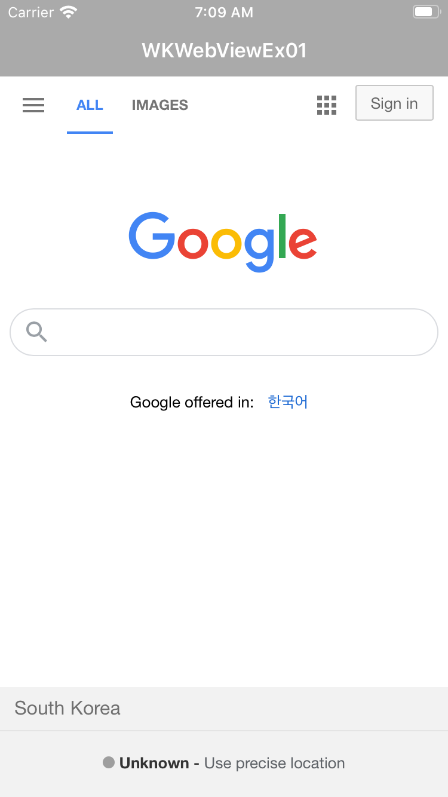

# Introduction

This project is the 1st example of WK web view based on iOS in Swift. Its definition is code-based, not using storyboard. This example demonstrates

* how to load a web page using a WK web view

---

# Screenshot

This sample app show a table view with customized cells.

</img>

Icons made by [Freepik](https://www.flaticon.com/authors/freepik) from [www.flaticon.com](https://www.flaticon.com/)

---

# How to load a web page using a WK web view

* Step 1: Define a WKWebView object

```
let webConfiguration: WKWebViewConfiguration = WKWebViewConfiguration()
let webView = WKWebView(frame: .zero, configuration: webConfiguration)
```

* Step 2: Assign the UI and navigation delegate of the WKWebView object.

```
// self means the view controller of the web view
webView.uiDelegate = self
webView.navigationDelegate = self
```

* Step 3: Define URL object with the address of the web page

```
let url = URL(string: "https://www.google.com")
```

* Step 4: Define URLRequest object with the URL object defined at step 3.

```
let request = URLRequest(url: url)
```

* Step 5: Call load method of the WKWebView object with the URLRequest object defined at step 4.

```
load(request)
```

---

# Extension of WKWebView class

I extended WKWebView class to load a web page more simply by just calling a method.

```
extension WKWebView {

    func load(string: String) {
        guard let url = URL(string: string) else {
            return
        }

        let request = URLRequest(url: url)
        load(request)
    }

}
```

---

# Unit Test

Wrote unit test code to check
* It is impossible to check the contents of image views with UI test, but possible with unit test.
* To test ExViewController class, define its child class ExViewController

```
class ExViewControllerTests: XCTestCase {

    var vc: ExViewController?

    override func setUpWithError() throws {
        vc = ExViewController()
    }

    override func tearDownWithError() throws {
    }

    func testIsLoading() throws {
        if let isLoading = vc?.exWebView.isLoading {
            XCTAssertFalse(isLoading)
        }
    }

    func testCanGoBack() throws {
        if let canGoBack = vc?.exWebView.canGoBack {
            XCTAssertFalse(canGoBack)
        }
    }

    func testURL() throws {
        if let urlString = vc?.exWebView.url?.absoluteString {
            XCTAssertEqual("https://www.google.com", urlString)
        }
    }

}
```

---

# UI Test

* Tested if there exists the web view with accessibility identifier.

```
let exWebView = app.webViews["exWebView"]
XCTAssertTrue(exWebView.exists)
```

---

# References

* [WKWebView class](https://developer.apple.com/documentation/webkit/wkwebview)
* [WKWebViewConfiguration class](https://developer.apple.com/documentation/webkit/wkwebviewconfiguration)
* [WKUIDelegate protocol](https://developer.apple.com/documentation/webkit/wkuidelegate)
* [WKNavigationDelegate protocol](https://developer.apple.com/documentation/webkit/wknavigationdelegate)
